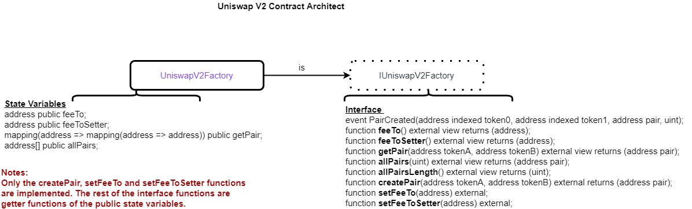

# Uniswap V2 Protocol Analysis

## UniswapV2Factory.sol

``` solidity
pragma solidity =0.5.16;
import './interfaces/IUniswapV2Factory.sol';
import './UniswapV2Pair.sol';  //for calling UniswapV2Pair functions
contract UniswapV2Factory is IUniswapV2Factory { //very simple inheritance
```



**The createPair Function ** 

```solidity
function createPair(address tokenA, address tokenB) external returns (address pair) {
        require(tokenA != tokenB, 'UniswapV2: IDENTICAL_ADDRESSES');
        (address token0, address token1) = tokenA < tokenB ? (tokenA, tokenB) : (tokenB, tokenA);
        require(token0 != address(0), 'UniswapV2: ZERO_ADDRESS');
        require(getPair[token0][token1] == address(0), 'UniswapV2: PAIR_EXISTS'); 
        // single check is sufficient
        bytes memory bytecode = type(UniswapV2Pair).creationCode;
        bytes32 salt = keccak256(abi.encodePacked(token0, token1));
        assembly {
            pair := create2(0, add(bytecode, 32), mload(bytecode), salt)
        }
        IUniswapV2Pair(pair).initialize(token0, token1);
        getPair[token0][token1] = pair;
        getPair[token1][token0] = pair; // populate mapping in the reverse direction
        allPairs.push(pair);
        emit PairCreated(token0, token1, pair, allPairs.length);
    }
```

